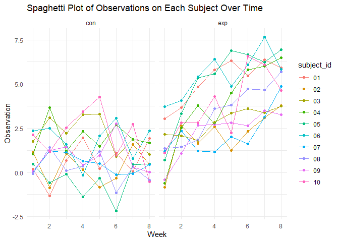

p8105_hw5_yw3995
================
Yuxuan Wang
2023-11-11

``` r
library(readr)
library(tidyverse)
library(rvest)
library(ggplot2)
```

# Problem 1

``` r
raw_data = "https://raw.githubusercontent.com/washingtonpost/data-homicides/master/homicide-data.csv"

raw_data = read.csv(raw_data)
```

- Raw data describe the homicides in 50 large U.S. cities, which
  contains **12** variables and **52179** observations.
- Raw data has lots of variables, such as: uid, reported_date,
  victim_last, victim_first, victim_race, victim_age, victim_sex, city,
  state, lat, lon, disposition, and the key variables are **city, state,
  disposition**.

``` r
tidy_data =
  raw_data |> 
  mutate(city_state = paste(city, state, sep = ", ")) |> 
  group_by(city_state) |> 
  summarise(
    total_homicides = n(), 
    unsolved_homicides = sum(disposition %in% c("Closed without arrest", "Open/No arrest"))  
  )

tidy_data = tidy_data[tidy_data$city_state != "Tulsa, AL", ] 

tidy_data
```

    ## # A tibble: 50 × 3
    ##    city_state      total_homicides unsolved_homicides
    ##    <chr>                     <int>              <int>
    ##  1 Albuquerque, NM             378                146
    ##  2 Atlanta, GA                 973                373
    ##  3 Baltimore, MD              2827               1825
    ##  4 Baton Rouge, LA             424                196
    ##  5 Birmingham, AL              800                347
    ##  6 Boston, MA                  614                310
    ##  7 Buffalo, NY                 521                319
    ##  8 Charlotte, NC               687                206
    ##  9 Chicago, IL                5535               4073
    ## 10 Cincinnati, OH              694                309
    ## # ℹ 40 more rows

``` r
baltimore_df = raw_data |> 
  mutate(city_state = paste(city, state, sep = ", ")) |> 
  mutate(disposition = ifelse(disposition == "Closed by arrest", "homicides", "unsolved_homicides")) |> 
  filter(city_state == "Baltimore, MD")

baltimore_result = prop.test(x = sum(baltimore_df$disposition %in% c("unsolved_homicides")), n = nrow(baltimore_df), correct = FALSE)

baltimore_result_tidy = broom::tidy(baltimore_result) |> 
  mutate(confidence_intervals = paste(conf.low, conf.high, sep = ", ")) |> 
  rename(estimated_proportion = estimate) |> 
  select(estimated_proportion, confidence_intervals) 

baltimore_result_tidy
```

    ## # A tibble: 1 × 2
    ##   estimated_proportion confidence_intervals                
    ##                  <dbl> <chr>                               
    ## 1                0.646 0.627741062080148, 0.662985215590964

``` r
city_df = tidy_data |> 
  mutate(
    city_test_result = map2(unsolved_homicides, total_homicides, ~prop.test(x = .x, n = .y)),
    city_tidy_result = map(city_test_result, broom::tidy)
  ) |> 
  select(city_state, city_tidy_result) |> 
  unnest(city_tidy_result) |> 
  select(city_state, estimate, conf.low, conf.high) 


city_tidy_df = city_df |> 
  mutate(confidence_intervals = paste(conf.low, conf.high, sep = ", ")) |> 
  rename(estimated_proportion = estimate) |> 
  select(city_state, estimated_proportion, confidence_intervals)

city_tidy_df
```

    ## # A tibble: 50 × 3
    ##    city_state      estimated_proportion confidence_intervals                
    ##    <chr>                          <dbl> <chr>                               
    ##  1 Albuquerque, NM                0.386 0.337260384254284, 0.437576606555521
    ##  2 Atlanta, GA                    0.383 0.352811897036302, 0.414821883953622
    ##  3 Baltimore, MD                  0.646 0.627562457662644, 0.663159860401662
    ##  4 Baton Rouge, LA                0.462 0.414198741860307, 0.511023960018796
    ##  5 Birmingham, AL                 0.434 0.399188948632167, 0.468955748189036
    ##  6 Boston, MA                     0.505 0.464621930200304, 0.545088051772638
    ##  7 Buffalo, NY                    0.612 0.568798964634228, 0.654087939253532
    ##  8 Charlotte, NC                  0.300 0.26608198188312, 0.335899860867845 
    ##  9 Chicago, IL                    0.736 0.723995888425454, 0.747399787306647
    ## 10 Cincinnati, OH                 0.445 0.407960574220688, 0.483143880618937
    ## # ℹ 40 more rows

``` r
ggplot(city_df, aes(x = reorder(city_state, estimate), y = estimate)) +
  geom_point(size = 3) +
  geom_errorbar(aes(ymin = conf.low, ymax = conf.high), width = 0.2, color = "red") +
  coord_flip() +  
  labs(x = "City",
       y = "Estimated Proportion of Unsolved Homicides",
       title = "Estimates and Confidence Intervals by City") +
  theme_minimal()
```

<!-- -->

# Problem 2

``` r
file_names = list.files(path = "./data/", full.names = TRUE)

files_df = data.frame(file_path = file_names) |>
  mutate(file_name = basename(file_path),
         arm = sub("_.*", "", file_name), 
         subject_id = sub(".*_", "", sub("\\..*", "", file_name))) 

read_data = function(file_path) {
  read_csv(file_path) |>
    gather(key = "week", value = "observation") 
}

tidy_data_q2 = files_df |>
  mutate(data = map(file_path, read_data)) |> 
  unnest(data) |> 
  mutate(week = as.numeric(gsub("week_", "", week))) |> 
  select(arm, subject_id, week, observation) |> 
  select(subject_id, everything())

tidy_data_q2
```

    ## # A tibble: 160 × 4
    ##    subject_id arm    week observation
    ##    <chr>      <chr> <dbl>       <dbl>
    ##  1 01         con       1        0.2 
    ##  2 01         con       2       -1.31
    ##  3 01         con       3        0.66
    ##  4 01         con       4        1.96
    ##  5 01         con       5        0.23
    ##  6 01         con       6        1.09
    ##  7 01         con       7        0.05
    ##  8 01         con       8        1.94
    ##  9 02         con       1        1.13
    ## 10 02         con       2       -0.88
    ## # ℹ 150 more rows

``` r
spaghetti_plot = ggplot(tidy_data_q2, aes(x = week, y = observation, color = subject_id)) +
  geom_point() +
  geom_line() +
  facet_wrap(~arm) +
  labs(
    x = "Week",
    y = "Observation",
    title = "Spaghetti Plot of Observations on Each Subject Over Time",
    color = "subject_id"
  ) +
  theme_minimal()

spaghetti_plot
```

<!-- -->

- In the `con` (control) group, we observe that weekly observations
  **consistent fluctuations** within the **range of -1.25 to 3.75**.
  However, in the `exp` (experimental) group, we can see a **weekly
  increase** in observations of approximately **3.125**.

# Problem 3

``` r
set.seed(123)
```

## Generate 5000 datasets from the model

``` r
sim_mean_sd = function(n = 30, mu = 0, sigma = 5){
   sim_data = tibble(
    x = rnorm(n, mean = mu, sd = sigma),
  )
  sim_data |> 
    summarize(
      mu_hat = mean(x),
      sigma_hat = sd(x)
    )
}

output = vector("list", 5000)

for (i in 1:5000) {
  output[[i]] = sim_mean_sd(30)
}

sim_results = bind_rows(output)
```

## Obtain the estimate and p-value when μ=0

``` r
sample_means = numeric(5000)
p_values = numeric(5000)

n = 30
sigma = 5
mu = 0

for (i in 1:5000) {
  data = rnorm(n, mean = mu, sd = sigma)
  
  t_test_result = t.test(data)
  result_tidy = broom::tidy(t_test_result)
  
  sample_means[i] = result_tidy$estimate
  p_values[i] = result_tidy$p.value
}

alpha = .05
power = mean(p_values < alpha)

cat("Estimated:", sample_means[i], "\n")
```

    ## Estimated: -0.8313884

``` r
cat("Estimated Power:", power, "\n")
```

    ## Estimated Power: 0.0484

## μ={1,2,3,4,5,6}

``` r
library(broom)
```

    ## Warning: package 'broom' was built under R version 4.3.2

``` r
library(dplyr)

n = 30
sigma = 5
alphas = 0.05  
mu_values = 0:6  

results = data.frame(mu = numeric(), estimate = numeric(), p_value = numeric(), rejected = logical())

for (mu in mu_values) {
  sample_means = numeric(5000)
  p_values = numeric(5000)
  
  for (i in 1:5000) {
    data = rnorm(n, mean = mu, sd = sigma)
    t_test_result = t.test(data, mu = 0)
    result_tidy = tidy(t_test_result)
    sample_means[i] = result_tidy$estimate
    p_values[i] = result_tidy$p.value
  }
 
  rejected = p_values < alphas
  results = rbind(results, data.frame(mu = rep(mu, 5000), estimate = sample_means, p_value = p_values, rejected = rejected)) 
}
```

## A plot showing “Power vs. Effect Size in a One-Sample t-Test”

``` r
mean_power = results |> 
  group_by(mu) |> 
  summarize(power = mean(rejected))

ggplot(mean_power, aes(x = mu, y = power)) +
  geom_line() +
  geom_point() +
  labs(x = "True μ (Effect Size)", y = "Power") +
  ggtitle("Power vs. Effect Size in a One-Sample t-Test")
```

<!-- -->

- There is a **positive relationship** between effect size and power,
  which means as Effect Size grows, Power grows. And the Power
  approaches to 1 gradually.

## A plot showing “Average Estimate of μ^ vs. μ (and Only the Null Was Rejected”

``` r
result_rejected = results |> 
  group_by(mu) |> 
  summarise(
    mean_mu_hat = mean(estimate),
    mean_mu_hat_rejected = mean(estimate[rejected])
  )

ggplot(result_rejected, aes(x = mu)) +
  geom_line(aes(y = mean_mu_hat, color = 'pink')) +
  geom_line(aes(y = mean_mu_hat_rejected, color = 'skyblue')) +
  
  geom_point(aes(y = mean_mu_hat, color = 'pink')) +
  geom_point(aes(y = mean_mu_hat_rejected, color = 'skyblue')) +
  
  labs(x = "True μ", y = "Average Estimate of μ^", color = "average estimate of μ^") +
  ggtitle("Average Estimate of μ^ vs. μ (and Only the Null Was Rejected)") +
  scale_color_manual(values = c("pink" = "pink", "skyblue" = "skyblue"), 
                     labels = c("pink" = "average estimate of μ^", "skyblue" = "average estimate of μ^ rejected"))
```

<!-- -->

- We find the sample average of μ^ across tests for which the null is
  rejected **not approximately equal** to the true value of μ when μ =
  1, 2, and **approximately equal** when μ = 3, 4, 5, 6.

- *Not approximately equal*: the effect size is small, and relatively
  close to the null hypothesis value. This may because the sampling
  variability and sampling Error, which will causes inherent randomness
  and the sample average of μ^ across tests for which the null is
  rejected not approximately equal to the true value of μ.

- *Approximately equal*: the effect size is larger, making it easier to
  detect a statistically significant difference. This can result in the
  sample average of μ^ being approximately equal to the true values
  because the differences are more pronounced and easier to detect.
